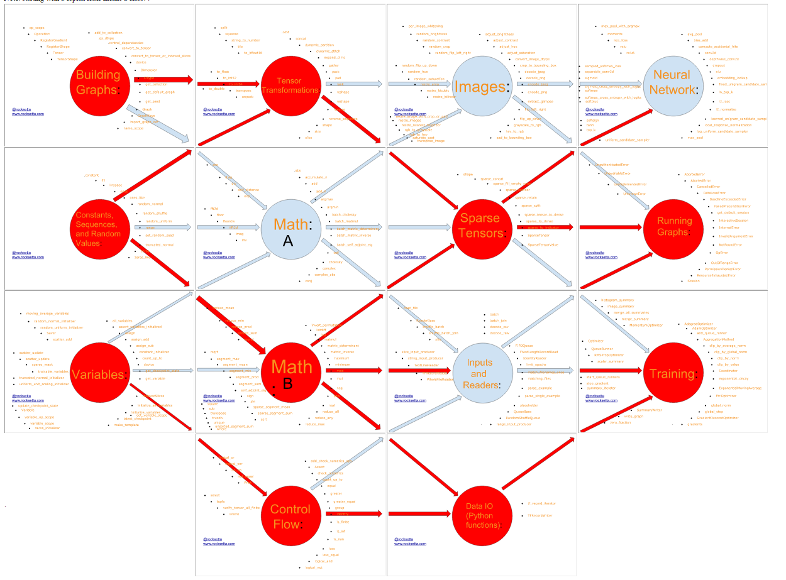

# easy-tensorflow-on-cloud9
Hopefully the easiest way to get started with Google's TensorFlow Deep Learning Neural Network Python Library

install onto cloud9 http://c9.io as a custom workspace

Using the url for this repository 

https://github.com/hpssjellis/easy-tensorflow-on-cloud9.git

#In the terminal type
bash setup.sh

Then hopefully try some examples in the rocksetta-example folder 

My TensorFlow API diagram is at http://rocksetta.com/tensorflow-teacher/tensorflow-svg.html which is a clickable version of

My Tensorflow-teacher site is at http://rocksetta.com/tensorflow-teacher/

other peoples examples are in the other folders. A good starting point is the try-tf folder explained at this website

https://bcomposes.wordpress.com/2015/11/26/simple-end-to-end-tensorflow-examples/

